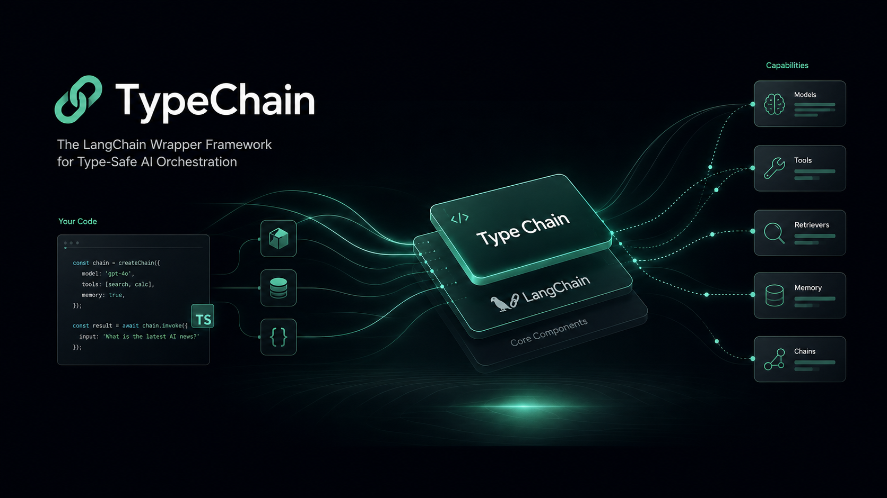

<div align="center">
  

  <h1>TypeChain</h1>

  **Decorator-first, type-safe authoring for LangChain JS tools and agents.**

  [](package.json)
  [](https://www.typescriptlang.org/docs/handbook/release-notes/typescript-5-0.html)
  [](https://js.langchain.com/)
  [](LICENSE)
</div>

> **Unreleased development branch:** TypeChain is private and has **no npm publication**. The implemented surfaces below are available from this repository's `dev` branch only; package ownership and release authorization have not been established.
>
> **Runtime boundary:** TypeChain records declarations and composes standard LangChain tools and agents. Model selection, credentials, authorization, approvals, retries, timeouts, persistence, redaction, and audit policy remain application responsibilities.

TypeChain keeps explicit runtime schemas and LangChain contracts visible while making TypeScript tool and agent declarations easier to author. It supports standard (Stage 3) decorators—without legacy reflection metadata—and delegates execution semantics to LangChain and, when used, TypeMCP.

## Fast path

1. Clone this repository and work from the `dev` branch; do not install `type-chain` from npm because it is not published.
2. Use `@Tool()` plus an explicit object runtime schema to declare an instance method.
3. Import `toLangChainTools()` from `type-chain/langchain` to create standard LangChain tools.
4. Import `@Agent()` and `buildAgent()` from `type-chain/agent` when the application owns a LangChain model and agent lifecycle.
5. Use `type-chain/typemcp` only for in-process composition of a TypeMCP-decorated server; it does not open an MCP transport.

## Development setup

TypeChain requires **Node.js 20 or later**, ESM-aware TypeScript configuration, and standard TypeScript decorators. The repository currently provides the unreleased development package through its local workspace.

```bash
git clone https://github.com/Theorvane/type-chain.git
cd type-chain
git switch dev
npm ci
npm run verify
```

For a consuming TypeScript application, use a Node-aware compiler configuration and do **not** enable TypeScript's legacy `experimentalDecorators` mode for these examples:

```json
{
  "compilerOptions": {
    "target": "ES2022",
    "module": "NodeNext",
    "moduleResolution": "NodeNext",
    "lib": ["ES2022", "ESNext.Decorators"],
    "strict": true,
    "verbatimModuleSyntax": true
  }
}
```

## Define a tool and build an agent

Install the optional runtime packages in the application that consumes the development package. This example uses OpenAI, so it also needs `@langchain/openai` and `OPENAI_API_KEY`.

```bash
npm install @langchain/core langchain @langchain/openai zod
```

```ts
import { Tool } from "type-chain";
import { Agent, buildAgent } from "type-chain/agent";
import { initChatModel } from "langchain";
import { z } from "zod";

@Agent({ systemPrompt: "Use the available issue-search tool when helpful." })
class IssueTools {
  @Tool({
    name: "search_issues",
    description: "Search repository issues by query.",
    schema: z.object({ query: z.string().min(1) }),
  })
  async searchIssues({ query }: { readonly query: string }) {
    return { query, source: "application-owned issue client" };
  }
}

const model = await initChatModel("openai:gpt-4.1-mini");
const agent = buildAgent(new IssueTools(), { model });

await agent.invoke({
  messages: [{ role: "user", content: "Find TypeChain issues." }],
});
```

`buildAgent()` delegates to LangChain's `createAgent()`. `@Tool()` metadata is adapted through LangChain Core, which owns supported-schema parsing and validation.

## Capability map

| Surface | Development branch status | What it does |
| --- | --- | --- |
| `@Tool()` / `getToolDefinitions()` | Implemented | Records explicit tool metadata and returns immutable, receiver-bound definitions for public instance methods. |
| `@Policy()` / `ToolDefinition.policy` | Implemented | Records immutable, declarative policy intent; it never authorizes, retries, logs, or executes a tool. |
| `withToolPolicyGuard()` | Implemented | Calls an application-supplied guard before a tool that declares policy metadata; TypeChain supplies no default allow/deny decision. |
| `type-chain/langchain` / `toLangChainTools()` | Implemented | Converts decorated tools into standard LangChain structured tools. |
| `type-chain/langchain` / `toGuardedLangChainTools()` | Implemented | Converts decorated tools into standard LangChain structured tools while invoking an application-supplied guard for declared policy metadata. |
| `type-chain/agent` / `@Agent()` / `buildAgent()` | Implemented | Adds class-level prompt metadata and delegates decorated-tool agent construction to LangChain `createAgent()`. |
| `type-chain/agent` / `buildGuardedAgent()` | Implemented | Builds a standard LangChain agent that invokes an application-supplied guard for declared policy metadata. |
| `type-chain/typemcp` / `createTypeMcpLangChainTools()` | Implemented | Converts a TypeMCP-decorated server into LangChain tools in the current Node.js process. |
| `type-chain/typemcp` / `createTypeMcpAgent()` | Implemented | Resolves TypeMCP tools, then delegates agent construction to LangChain. |
| `type-chain/typemcp` / `createGuardedTypeMcpAgent()` | Implemented | Delegates guarded in-process TypeMCP tools to LangChain while the application decides whether each invocation proceeds. |
| HTTP or stdio MCP hosting | Not provided | Use TypeMCP's transport hosts when an MCP server must communicate across processes. |
| Runtime policy enforcement | Not provided | The application must enforce authorization, approval, retries, timeouts, audit, redaction, and persistence. |
| npm distribution | Not published | This repository is private and its package name is not currently available on npm. |

### Schema contract

`@Tool()` accepts an explicit, non-null runtime schema object. For `toLangChainTools()`, the schema must describe a **structured object input**: for example, a Zod object (including an object wrapped by a refinement or transform) or JSON Schema with `type: "object"`.

Primitive schemas are intentionally rejected by the LangChain adapter because the dynamic-tool fallback would not preserve their validation semantics. TypeChain passes accepted schemas through; LangChain Core owns parsing and validation.

### Policy declaration contract

`@Policy()` can be applied to the same public instance method as `@Tool()` in either decorator order. It records an immutable `ToolDefinition.policy` snapshot with only explicit intent: `authorization`, `approval`, `audit`, and `idempotency` may be set to `"required"`; `timeoutMs` and `retry.maxAttempts` must be positive safe integers.

```ts
import { Policy, Tool } from "type-chain";

@Policy({
  authorization: "required",
  approval: "required",
  audit: "required",
  retry: { maxAttempts: 3 },
})
@Tool({ /* explicit name, description, and object schema */ })
async updateIssue(input: UpdateIssueInput) { /* application behavior */ }
```

Policy metadata does **not** enforce authorization, approval, retry, timeout, idempotency, audit, or redaction. An application reads the declaration and applies its own reviewed middleware or guards before exposing a state-changing tool.

### Guard composition

`withToolPolicyGuard(instance, guard)` returns new frozen receiver-bound definitions. It invokes the supplied application guard only for definitions that declare `@Policy()` metadata; the guard receives the original immutable definition, its policy snapshot, and the original input. Throwing or rejecting prevents the method invocation and its error is propagated unchanged.

```ts
import { withToolPolicyGuard } from "type-chain";

const guardedDefinitions = withToolPolicyGuard(new IssueTools(), async ({
  definition,
  input,
  policy,
}) => {
  await applicationPolicyMiddleware({ definition, input, policy });
});
```

This helper performs no default authorization, approval, retry, timeout, idempotency, audit, or redaction decision. For the optional LangChain boundary, import `toGuardedLangChainTools()` from `type-chain/langchain` with the same application guard; LangChain Core continues to own structured-input parsing and validation before the guard is invoked. For the direct agent boundary, import `buildGuardedAgent()` from `type-chain/agent`; it delegates to LangChain `createAgent()` with those guarded tools and leaves model lifecycle and runtime policy decisions to the application.

## In-process TypeMCP composition

Use the optional `type-chain/typemcp` subpath when an external API is wrapped as a TypeMCP tool and the LangChain agent runs in the **same Node.js process**:

```text
external API client → TypeMCP-decorated tool + explicit resolver
                    → TypeMCP createLangChainTools()
                    → TypeChain createTypeMcpAgent()
                    → LangChain createAgent()
```

Install the optional TypeMCP and LangChain packages in the application:

```bash
npm install @theorvane/type-mcp @langchain/core langchain @langchain/openai zod
```

```ts
import { McpServer, McpTool } from "@theorvane/type-mcp";
import { createTypeMcpAgent } from "type-chain/typemcp";
import { initChatModel } from "langchain";
import { z } from "zod";

interface CatalogClient {
  findProduct(sku: string): Promise<unknown>;
}

declare const catalogClient: CatalogClient;

@McpServer({ name: "catalog_api", version: "1.0.0" })
class CatalogApiTools {
  private readonly client: CatalogClient;

  constructor(client: unknown) {
    if (!isCatalogClient(client)) {
      throw new TypeError("CatalogApiTools requires a catalog client.");
    }

    this.client = client;
  }

  @McpTool({
    name: "find_product",
    description: "Find a product through the catalog API.",
    input: z.object({ sku: z.string().min(1) }),
  })
  async findProduct({ sku }: { readonly sku: string }) {
    return this.client.findProduct(sku);
  }
}

function isCatalogClient(value: unknown): value is CatalogClient {
  return (
    typeof value === "object" &&
    value !== null &&
    "findProduct" in value &&
    typeof value.findProduct === "function"
  );
}

const model = await initChatModel("openai:gpt-4.1-mini");
const agent = await createTypeMcpAgent({
  model,
  server: CatalogApiTools,
  resolver: { resolve: () => new CatalogApiTools(catalogClient) },
});
```

TypeMCP owns its declaration validation, metadata interpretation, and resolver behavior. TypeChain does not create an HTTP/stdio transport or an MCP client/session lifecycle. The application owns the API client, credentials, authorization, approval, retries, timeouts, audit logging, and error/redaction policy.

## Architecture and boundaries

- [Architecture overview](docs/architecture.md) — public surfaces, composition boundaries, and non-goals.
- [Release guide](docs/release.md) — development versus release readiness and publication checks.
- [Contributing](CONTRIBUTING.md) — issue-first contribution and verification workflow.
- [Agent instructions](.agents/README.md) — repository-local guidance for coding agents.

`dev` is the default integration branch. `main` is release-only and accepts promotion PRs from the canonical `dev` branch. Until the repository becomes public, maintainers enforce the issue → issue-numbered branch → PR → current-HEAD review + CI → squash merge process manually; neither protected lane accepts direct pushes.

## Verify locally

```bash
npm ci
npm run lint
npm run typecheck
npm run test
npm run build
npm run verify:package
npm run verify:publish
```

## Community

[Code of Conduct](CODE_OF_CONDUCT.md) · [Security](SECURITY.md) · [Support](SUPPORT.md) · [Governance](GOVERNANCE.md) · [MIT License](LICENSE)
